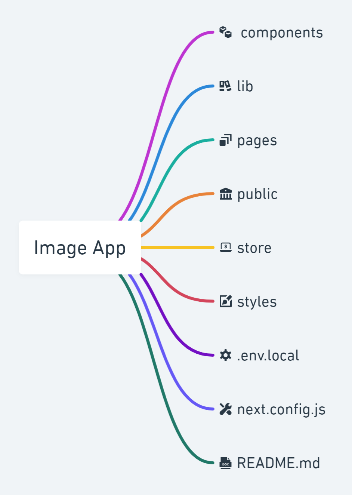
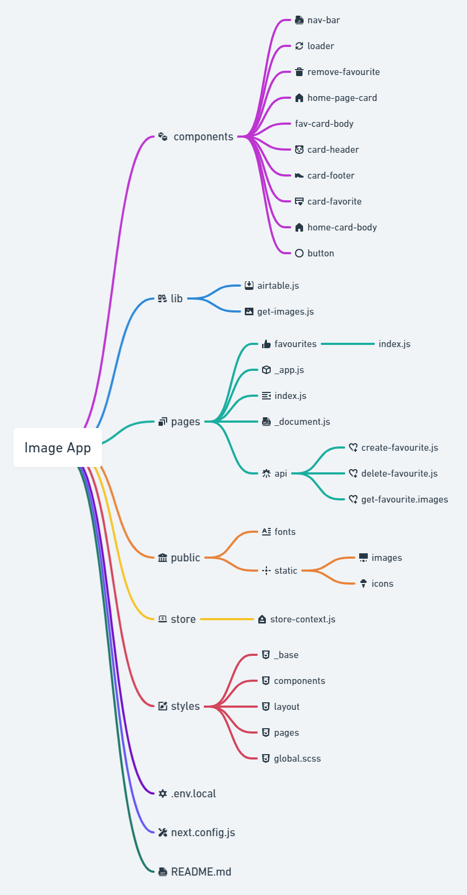

# Image App Documentation. 

This is a [Next.js](https://nextjs.org/) project bootstrapped with [`create-next-app`](https://github.com/vercel/next.js/tree/canary/packages/create-next-app).

## Getting Started
[live link](https://image-app-ten.vercel.app/)
### how to run it locally

1. clone the repo to your local machine

2. Then do a npm install to install the dependencies.

```bash
npm i

```

3. To Run Locally, run the development server:

```bash
npm run dev
# or
yarn dev
```

4. Open [http://localhost:3000](http://localhost:3000) with your browser to see the result.

# Component Architecture

here is a overall folder and file structure for the application


## Components

these are the reusable functional react components.

## Lib

these are the server side code which are imported into the pages/api folder.

## Public

all the static files are located here.

## Store

here are the context api files.

## Styles

all the scss files are located here.

## .env.local

all the environment variables are located here.

## next.config.js

all the advanced configuration is located here.

## README.md

documentation foe the application.

## Detailed Look Inside The Folders



## How the application works

there are two pages 
1.  home page
2.  favorite page

### home page
to get random pictures. [unsplash api](https://unsplash.com/developers) is used.
api is called in home page.
api keys are set in env.local folder.
10 images are pre rendered.
images are pre rendered using getStaticProps in homePage.

to get the images fetchImages is called from the lib/get-images.js 
homepage functionalities
1.  like photos
2.  like count will dynamically change
3.  like images will be saved in a database([AIRTABLE](https://airtable.com/))

### favorite page

all the photos which are liked comes to the favorites page.
images are rendered in clint side.
using node fetch api for the api calls throughout the application.
hooks are used to call the initial render of the favorites images.

#### favorites page functionality.

1.  remove the favorite images.
 


